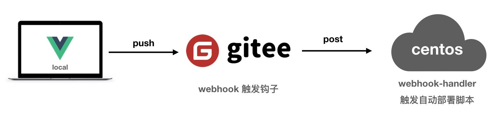
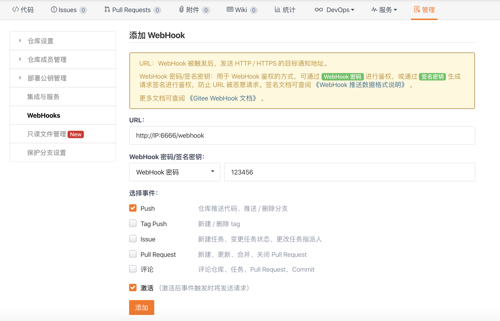
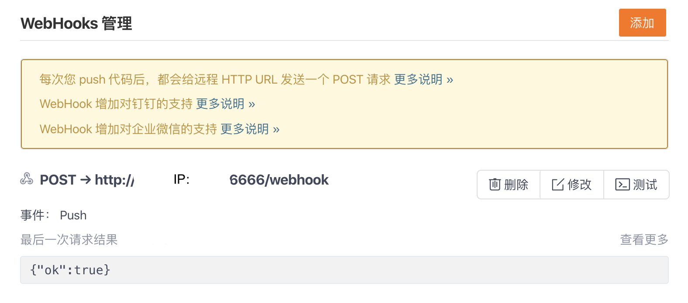

# Vue、Node等Gitee项目自动化部署到服务器



## 快速开始
```bash
# 拉取代码到服务器
git clone https://gitee.com/javanx/webhook.git

# cd webhook
cd webhook

# 安装依赖
$ npm install

# pm2启动服务
$ pm2 start webhook.js --name webhook -e ./logs/error.log -o ./logs/out.log
```

当然，还需要你根据自己的项目对响应配置做出修改，详情看下方细节描述

## Gitee添加WebHooks

进入到项目->管理->WebHooks->添加
输入服务器中配置好的地址密码，默认代码里面是123456



添加后，点击测试，可以看到ok，WebHooks配置完成。



这时候你push代码到gitee，服务器会自动同步你gitee的代码，完成部署

## 细节解释
### webhook.js
```javascript
var http = require('http')
var createHandler = require('gitee-webhook-handler')
var handler = createHandler({ path: '/webhook', secret: '123456' })

function run_cmd(cmd, args, callback) {
  var spawn = require('child_process').spawn;
  var child = spawn(cmd, args);
  var resp = "";
  child.stdout.on('data', function (buffer) { resp += buffer.toString(); });
  child.stdout.on('end', function () { callback(resp) });
}

http.createServer(function (req, res) {
  console.log('The server is running at *: 6666')
  handler(req, res, function (err) {
    res.statusCode = 404
    res.end('no such location')
  })
}).listen(6666)

handler.on('error', function (err) {
  console.error('Error:', err.message)
})

handler.on('Push Hook', function (event) {
  let pname = event.payload.repository.name
  console.log('Received a push event for %s to %s', pname, event.payload.ref);
  // pname 是项目名字，和gitee项目名称对应
  console.log(pname, '项目准备构建')
  switch (pname) {
    // admin项目是vue项目
    case 'admin': 
      run_cmd('sh', ['./deploy-admin.sh'], function (text) { console.log(text) });// 需要执>行的脚本位置
      break;
    // server是node项目
    case 'server':
      run_cmd('sh', ['./deploy-server.sh'], function (text) { console.log(text) });// 需要执>行的脚本位置
      break;
  }
})
```

这里启动服务可以通过`http://xxxx.xxx.xxx/6666`进行访问

### deploy-admin.sh
`admin` 项目执行脚本

```bash
VUE_PATH='/www/wwwroot/admin/' # 项目部署的根目录，需要先通过git clone xxx.git admin是项目名称

echo "开始准备构建项目" # 日志打印
cd $VUE_PATH # cd 到项目根目录
echo "拉取git最新代码"
git pull # 拉取代码
echo "npm install 安装最新模块"
# 切换node(暂时不需要)
# nvm use v10.14.1
# install，避免添加了新的模块而找不到依赖
npm install # 安装依赖

echo "删除dist目录下老版本代码"
# 删除原来的代码
rm -rf dist/* # 删除原来编译的dist目录

echo "npm run build构建项目"
# build
npm run build # 构建项目

echo "发布完成"
exit 0;
```

### deploy-server.sh
`server` 项目执行脚本
```bash
VUE_PATH='/www/wwwroot/server/' # 项目部署的根目录，需要先通过git clone xxx.git server是项目名称

echo "开始准备构建项目"
cd $VUE_PATH # cd 到项目根目录
echo "拉取git最新代码"
git pull # 拉取代码
echo "npm install 安装最新模块"
# 切换node(暂时不需要)
# nvm use v10.14.1
# install，避免添加了新的模块而找不到依赖
npm install # 安装依赖

echo "pm2 重启项目"
# build
pm2 restart server  # pm2 重启项目

echo "发布完成"
exit 0;
```

## 相关文章
如果您对pm2、git等不熟悉，可以点击下方文章

[Node应用的进程管理器: PM2详细介绍](https://www.javanx.cn/20190520/node-pm2/)

[git详细教程学习](https://www.javanx.cn/tag/git/)